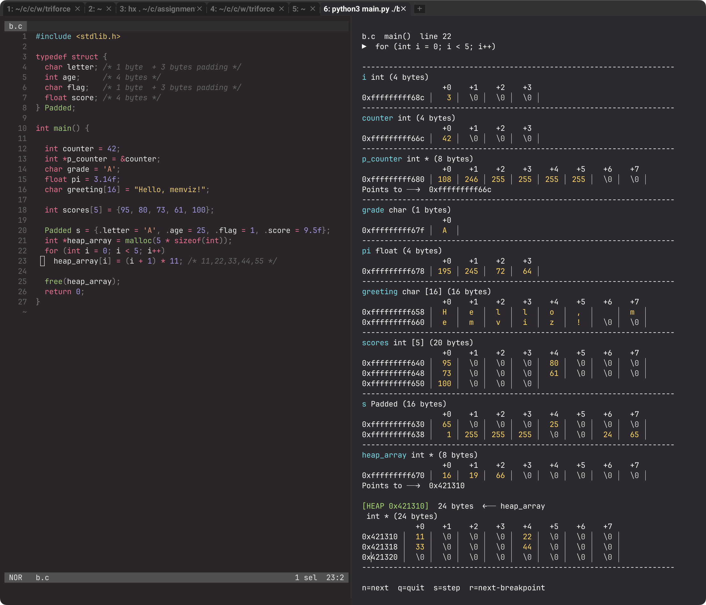

# memphis

GDB wrapper to visualize stack and heap of C program.



---

## Usage

**1 — Compile your program with debug symbols:**

```bash
gcc -g -O0 -o myprogram myprogram.c
#    ↑   ↑
#    |   disable optimizations (keeps variables alive)
#    debug symbols
```

**2 — Run memviz:**

```bash
# break at a specific line number (can be multiple breakpoints)
python3 main.py ./myprogram --line 20 25

# break at a function name
python3 main.py ./myprogram --func main

# for programs that read stdin (scanf etc.)
python3 main.py ./myprogram --line 20 --input "3 10 20 30"

# command line arguments
python3 main.py ./myprogram --line 20 --args abc abc abc
```

**3 — Navigate:**

| Key | Action                      |
| --- | --------------------------- |
| `n` | Next line (step over)       |
| `s` | Step into function call     |
| `r` | Continue to next breakpoint |
| `q` | Quit                        |

No Enter needed — keypresses register instantly.

---
